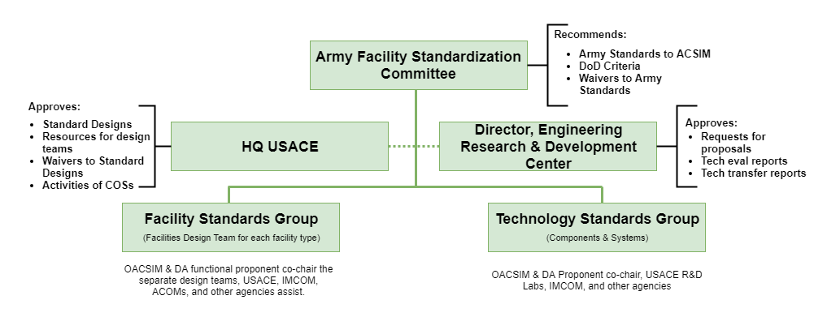

## Army Facilities Standardization Committee (AFSC)

## Army Standard Waiver Process

**Timeline:** Average processing time is 6 months

## Standard Design Waiver Process

**Purpose:** Define the process that USACE team (GD, COS, MSC, HQ) use to review and approve proposed changes to a facility Standard Design (SD) prior to award.

**Reference:** AR 420-1 Army Facilities Management, Appendix G

**Process:**

1. The Installation, User or GD identifies the need for waiver to the Standard Design. GD coordinates
   with the COS.
2. The COS validates whether a Standard Design/Criteria waiver is required. If a waiver is not required,
   the PDT proceeds with the project.
3. The Standard Design Waiver is reviewed for adverse impact to scope, cost, function or standard
   design. If there are no impacts, and the PDT and COS are in agreement, the COS completes
   approval document. A copy is provided to the HQUSACE MBP Manager. If the PDT and COS
   are NOT in agreement or adverse impacts will be incurred, the waiver package follows steps 4 thru 6
   for resolution.
4. The GD will forward the waiver package to the MSC for endorsement; the Waiver Request including a
   COS Position statement will be forwarded to the HQUSACE MBP Manager.
5. The MBP Manager will coordinate with the FDT and COS. Final recommendation will be provided to
   the HQUSACE DCG-MIO. The DCG-MIO will make final approval of the Standard Design Waiver
   request.
6. ACSIM, IMCOM, the Installation, MSC, GD, and COS will be advised of the HQUSACE decision
   ASAP. The COS will assess approved waiver for possible permanent change to the current Standard
   Design/Criteria.

**Draft Waiver Template:** See *Waiver Concurrence form April 11.doc* in the Library below.
